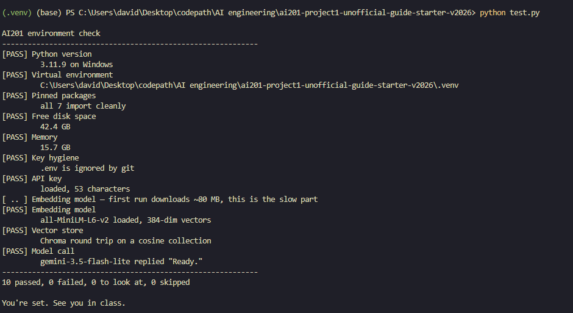
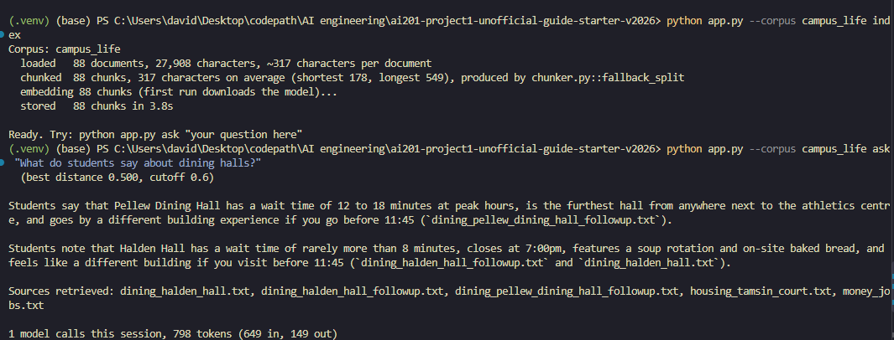
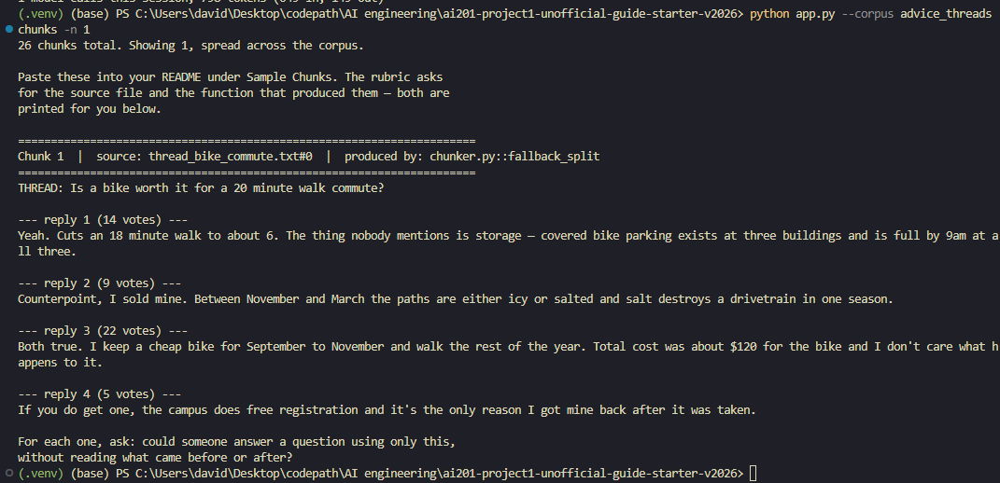

# Milestone 1 Observations

Selected corpus: campus_life

Documents loaded: 88
Chunks generated: 88
Average chunk length: 317 characters
Shortest chunk: 178 characters
Longest chunk: 549 characters

Starter chunking function: chunker.py::fallback_split

Sample question:
What do students say about dining halls?

Best retrieval distance: 0.500
Relevance cutoff: 0.600

The application successfully generated an answer with source citations.

Advice threads chunk count: 26

